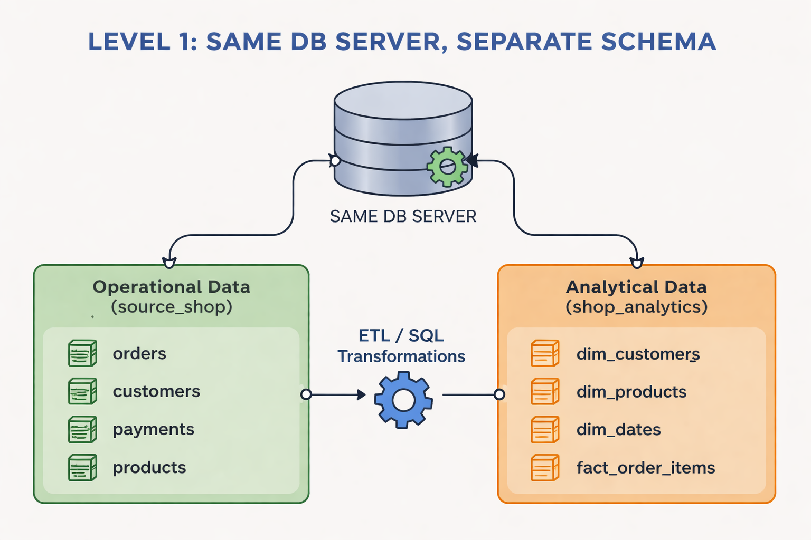
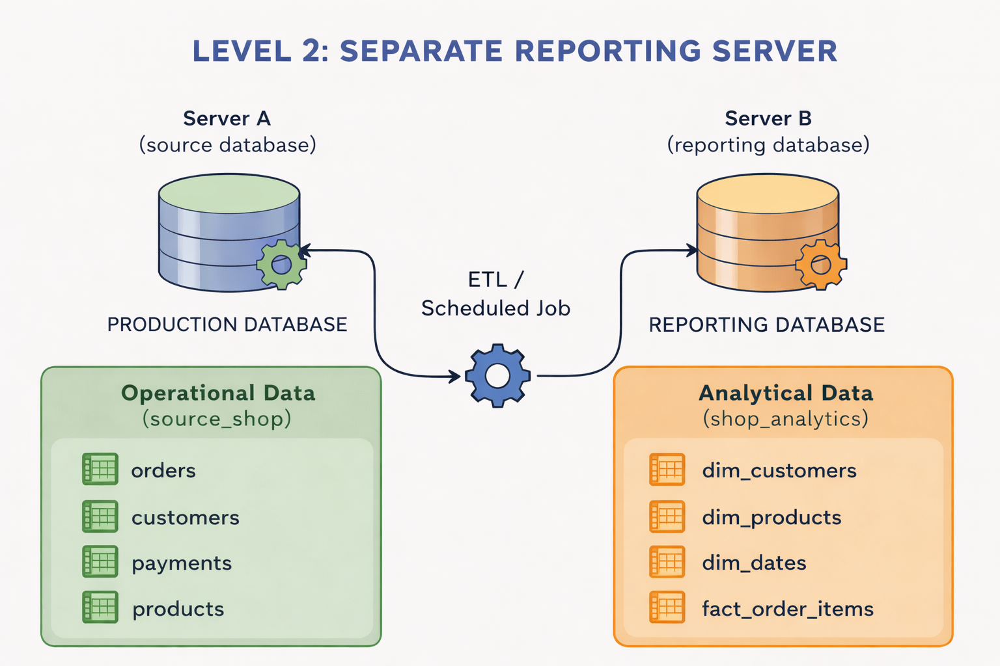
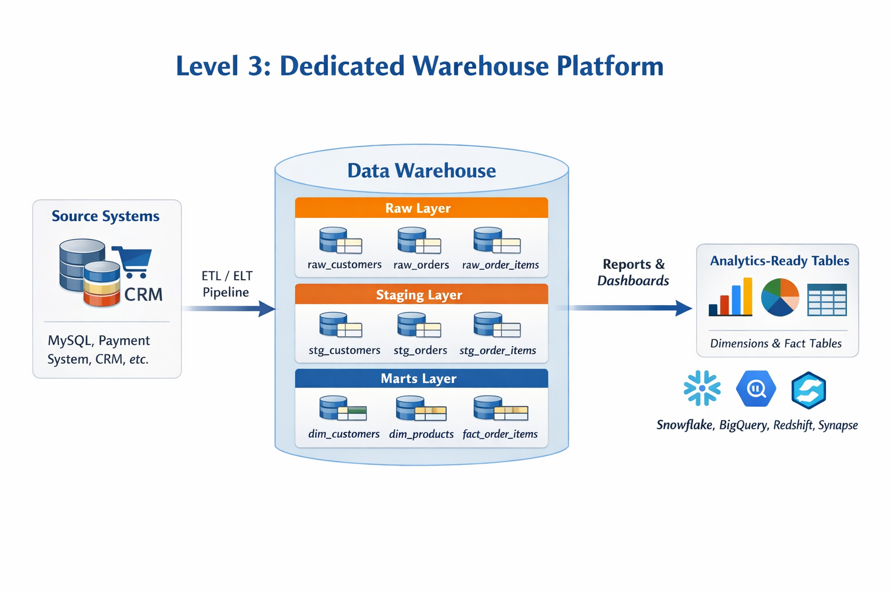

# Data Engineer Architecture Levels

This repository collects visual material and study support for the progression from **Level 1** to **Level 3** in a data engineering project.

## Repository structure

```text
.
├── assets/
│   ├── level-1-data-engineer.png
│   ├── level-2-data-engineer.png
│   ├── level-3-data-engineer.png
│   └── student-databases.png
├── docs/
│   ├── data-engineer-roadmap-english.pdf
│   └── exercise-data-engineer.docx
└── README.md
```

## Architecture levels

### Level 1 — Same database server
Operational data and analytical data live on the same database server, usually in separate schemas or databases.



### Level 2 — Separate reporting server
Operational data stays on the source server, while a scheduled ETL process moves and transforms it into a second reporting database.



### Level 3 — Dedicated warehouse platform
Data from one or more source systems is loaded into a dedicated warehouse platform. The warehouse is organized into layers such as **raw**, **staging**, and **marts**, where the final analytical models are built.



## Suggested GitHub description

Visual reference for Level 1, Level 2, and Level 3 data engineering architectures, including a dedicated warehouse platform example.

## Suggested repository name

`mysql-to-Datawarehouse`

## Notes

- File names were normalized to be GitHub-friendly.
- The Level 3 diagram was added to match the style of the previous Level 1 and Level 2 images.
- The `docs/` folder contains the supporting roadmap and exercise material.
